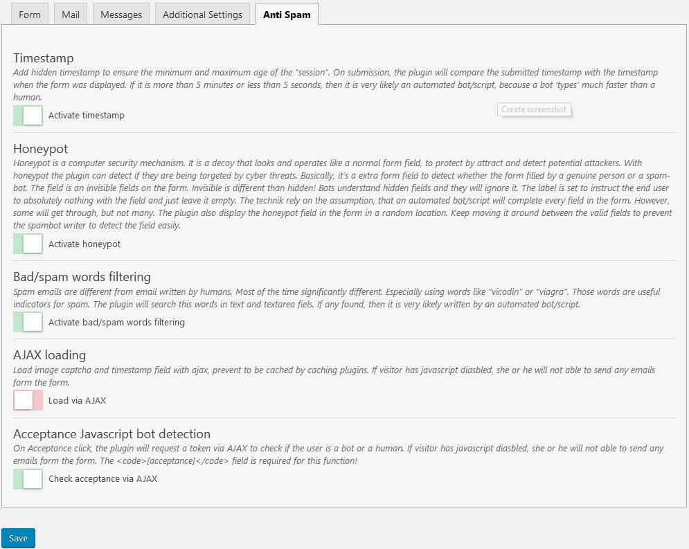
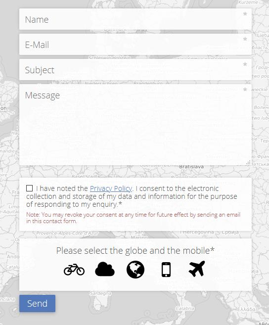

# Exopite-Anti-Spam
Anti Spam plugin with timestamp, honeypot (random location), token matching, bad/spam word filtering, email and domain blacklist and an image captcha.

## Description
Get rid of the Spam

This solution won't stop all spam on your site, but it should reject most of it. There is evidence to suggest that forms without CAPTCHA receive 20% - 30% more conversions, so you might want to disable CAPTCHA for further conversions due to the small costs of extra spam. Not to mention that the legal status of Google's reCaptcha is questionable under the current GDPR.

The plugin adds a timestamp, a honeypot with random location, token matching, bad/spam word filtering, email and domain blacklist and an image captcha to your Contact Form 7 forms by adding the shortcode <code>[easimagecaptcha]</code> to the form editor where you want the captcha to appear. This plugin uses the Font Awesome fonts as SVGs to display the icons used in the captcha.

## Features
* GDPR compliant
* Simple to use settings page for each contact from
* Text and error messages are translatable
* New image CAPTCHA each time form loads or submitted
* Customizable icon amount
* Customizable selection amount
* Loads with Ajax so as not to be cached by caching plugins
* Hidden honeypot field with a random position
* Timestamp against bots (min 3 sec max 5 min)
* Token matching
* Bad/spam word filtering
* Honeypot with random location
* E-Mail and domain blacklist

### GDPR compliant
The plugin does not use session and/or cookies nor save any private data.

### Simple to use settings page for each contact from
You can turn on/off features in each form.

### Text and error messages are translatable
Texts and error messages can be translated into any language, so -in this was- they can be personalized.

### Customizable icon and selection amount
You can customize the amount of icons to display and the icons to select.

### Loads with Ajax so as not to be cached by caching plugins
You can load the whole Contact Form 7 with AJAX or only the image captcha and the timestamp.  
If you load the whole Contact Form 7 with AJAX the spam-bots can not find any form to work with. 
To activate this function please use the <code>[contact-form-7-ajax id="YOUR-CF7-ID" title="YOUR-CF7-TITLE"]</code> shortcode.
If you load the image captcha and the timestamp with AJAX your caching plugin will not cache those. 
With this option enabled, visitors with JavaScript disabled, can not send any E-Mails with the form.

### Honeypot with random location
Honeypot is a computer security mechanism. It is a decoy that looks and operates like a normal form field, to protect by attract and detect potential attackers. With honeypot the plugin can detect if they are being targeted by cyber threats.
Basically, it's a extra form field to detect whether the form filled by a genuine person or a spam-bot. The field is an invisible fields on the form. Invisible is different than hidden! Bots understand hidden fields and they will ignore it. The label is set to instruct the end user to absolutely nothing with the field and just leave it empty. The technique rely on the assumption, that an automated bot/script will complete every field in the form. However, some will get through, but not many.
The plugin also display the honeypot field in the form in a random location. Keep moving it around between the valid fields to prevent the spam-bot writer to detect the field easily.

### Timestamp
The plugin also apply a timestamp as a hidden input on the form to ensure the minimum and maximum age of the "session". On submission, the plugin will compare the submitted timestamp with the timestamp when the form was displayed. If it is more than 5 minutes or less than 3 seconds, then it is very likely an automated bot/script, because a bot 'types' much faster than a human.

### Token matching
The plugin will generate an anonymous "token" on each form request, this is essentially a unique secret code. This token will be encrypted with a random salt and also is going to be applied as a hidden input on the form when it is generated in the browser. After the submission of the form, first the token will be checked against the database and then stored for a months. What this does is ensure that, on every submission of the form, is your form and not some automated bot/script try to submission the from a different server. It also ensure that, every form used only one time. Spammer can download the form and submit it multiple times.

### Bad/spam word filtering
Spam emails are different from email written by humans. Most of the time significantly different. Especially using words like "vicodin" or "viagra". Those words are useful indicators for spam. The plugin will search this words in text and textarea fields. If any found, then it is very likely written by an automated bot/script.

### E-Mail and domain blacklist
The plugin allows you to filter certain email addresses and domains.

## Compatibility
* Contact Form 7 - Repeatable Fields
* Drag and Drop Multiple File Upload - Contact Form 7
* Really Simple CAPTCHA
* Popup for Contact Form 7
* Redirection for Contact Form 7
* Advanced CF7 DB
* Contact Form 7 - Dynamic Text Extension
* Contact Form 7 Syntax Highlighting
* Contact Form 7 - Blacklist Unwanted Email
* Contact Form 7 - Show Page
* Contact Form 7 Email Spam Blocker
* Contact Form 7 Database
* Contact Form CFDB7
* Contact Form Entries

### Not with whole form AJAX loading
* Contact Form 7 Conditional Fields
* Contact Form 7 Datepicker

## Screenshot

## Installation

1. Upload the content of `exopite-anti-spam` to the `/wp-content/plugins/exopite-anti-spam/` directory

2. Activate the plugin through the 'Plugins' menu in WordPress

## Requirements

Server

* WordPress 4.7+ (May work with earlier versions too)
* PHP 7.0+ (Required)

## Browsers

* Modern Browsers
* Firefox, Chrome, Safari, Opera, IE 10+
* Tested on Firefox, Chrome, Edge, IE 11

## CHANGELOG

= 20230203 =
* Compatibility update for CF7 7.3

= 20220620 =
* Better error messages and logging.

= 20201127 =
* Fix: The image captcha creates a PHP error if only one icon needs to be selected.

= 20200921 =
* Fix: "WordPress database error You have an error in your SQL syntax;"
* Remove: add_filter( 'wpcf7_verify_nonce', '__return_true' )

= 20191111 =
* Add Plugin Update Checker 4.8

= 20191104 =
* Initial release

## LICENSE DETAILS

The GPL license of Exopite Antispam grants you the right to use, study, share (copy), modify and (re)distribute the software, as long as these license terms are retained.

## SUPPORT/UPDATES/CONTRIBUTIONS

If you use my program(s), I would **greatly appreciate it if you kindly give me some suggestions/feedback**. If you solve some issue or fix some bugs or add a new feature, please share with me or mke a pull request. (But I don't have to agree with you or necessarily follow your advice.)

**Before open an issue** please read the readme (if any :) ), use google and your brain to try to solve the issue by yourself. After all, Github is for developers.

My **updates will be irregular**, because if the current stage of the program fulfills all of my needs or I do not encounter any bugs, then I have nothing to do.

**I provide no support.** I wrote these programs for myself. For fun. For free. In my free time. It does not have to work for everyone. However, that does not mean that I do not want to help.

I've always tested my codes very hard, but it's impossible to test all possible scenarios. Most of the problem could be solved by a simple google search in a matter of minutes. I do the same thing if I download and use a plugin and I run into some errors/bugs.

## DISCLAMER

NO WARRANTY OF ANY KIND! USE THIS SOFTWARES AND INFORMATIONS AT YOUR OWN RISK!
[READ DISCLAMER!](https://joe.szalai.org/disclaimer/)
License: GNU General Public License v3

 
